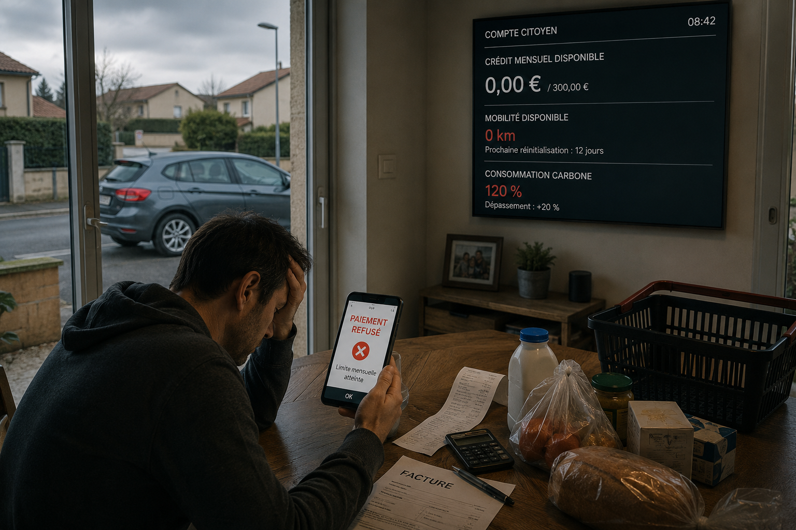

<p align="center">
  
</p>

> 🇫🇷 Français | [🇬🇧 English](./README.md)


[](https://www.youtube.com/@Palks_Studio)
[](https://www.linkedin.com/in/palks-studio/)

<p align="center">
  <a href="https://palks-studio.com">
    
  </a>
</p>

# 🇫🇷 Facturation électronique : données, infrastructures et interconnexions

## De la facture au produit, de l'identité au paiement

La réforme française de la facturation électronique est généralement présentée comme une transformation des échanges de factures et de données fiscales.

Cette enquête documentaire part de cette réforme pour examiner un périmètre beaucoup plus large.

En suivant les textes, normes, règlements, expérimentations et infrastructures officielles françaises et européennes, plusieurs univers que l'on pourrait croire indépendants apparaissent techniquement ou institutionnellement reliés :

**facturation électronique → données de transaction → produit → passeport numérique du produit (DPP) → données environnementales**

mais également :

**identité numérique → wallets européens → paiement → reçu électronique → produit**

et :

**système externe → vérification d'une condition → paiement conditionnel**

Pris séparément, chacun de ces dispositifs répond à une finalité propre.

L'objet de cette enquête est précisément d'étudier **les ponts documentés entre ces différentes infrastructures**, les capacités techniques qui en résultent, les limites juridiques qui les encadrent et les maillons qui restent aujourd'hui non établis.

Une chaîne technique reliant une transaction, un produit, des informations environnementales, un système externe et une logique conditionnelle autour d'un paiement peut ainsi être reconstruite à partir des éléments étudiés.

Cela ne signifie pas qu'un tel système soit actuellement utilisé de bout en bout.

L'enquête n'établit notamment pas qu'une donnée environnementale soit aujourd'hui utilisée pour autoriser, refuser ou limiter le paiement d'un individu, ni qu'un système centralisé de contrôle individuel de la consommation existe.

**C'est précisément la frontière entre ce qui existe, ce qui peut être interconnecté et ce qui n'est pas démontré que ce dossier cherche à documenter.**

---

## Ce que l'enquête examine

Le dossier suit notamment les relations entre :

- la facturation électronique et les données transmises à l'administration  
- leur conservation, leur accès et leurs finalités  
- les traitements et dispositifs de contrôle fiscal  
- le passeport numérique des produits (DPP) et les données environnementales  
- les reçus électroniques et l'identification des produits  
- les portefeuilles européens d'identité et d'entreprise  
- l'euro numérique et les mécanismes de paiement conditionnel  
- les possibilités d'interconnexion entre ces différentes infrastructures  
- les garanties apportées par le RGPD, la CNIL, le droit européen et les autres cadres juridiques applicables.

Le dossier ne cherche donc pas seulement à répondre à la question :

> **« Que change la facturation électronique ? »**

mais également à une question plus large :

> **« Que devient-il techniquement possible lorsque des infrastructures capables d'identifier une transaction, un produit, ses caractéristiques, une identité et un paiement deviennent interopérables ? »**

---

## Méthode

L'enquête repose sur des sources officielles françaises et européennes.

Chaque élément est qualifié afin de séparer les faits des déductions :

- **AVÉRÉ** : explicitement établi par une source officielle  
- **DÉDUCTIBLE TECHNIQUEMENT** : rendu possible par l'architecture documentée, sans usage établi  
- **HYPOTHÈSE** : scénario nécessitant davantage d'éléments  
- **À ÉTABLIR** : question restant ouverte

Cette distinction est essentielle : une capacité technique ne démontre ni son utilisation effective, ni sa légalité, ni une intention institutionnelle de l'utiliser.

---

## Lire l'enquête

**[Consulter le dossier complet au format PDF](pdf/facturation-electronique-enquete.pdf)**

Les 7 chapitres sont également disponibles séparément dans [`chapitres/`](chapitres/).

Le registre des sources officielles utilisées est disponible dans [`sources/sources.md`](sources/sources.md).

---

## Contenu du dépôt

```
facturation-electronique-enquete/
│
├── sommaire.md
├── dossier-complet.md
├── README.md
│
├── chapitres/
│   ├── 01-donnees-facturation.md
│   ├── 02-conservation-acces-finalites.md
│   ├── 03-donnees-environnementales.md
│   ├── 04-euro-numerique-paiements.md
│   ├── 05-interconnexions.md
│   ├── 06-garanties-juridiques.md
│   └── 07-synthese.md
│
├── sources/
│   └── sources.md
│
└── pdf/
    └── facturation-electronique-enquete.pdf
```

---

## Ce que ce dossier n'affirme pas

Ce travail ne vise pas à démontrer l'existence d'un « plan caché », à attribuer une intention non documentée aux institutions étudiées ou à présenter comme déployé un système qui ne l'est pas.

Il ne démontre pas l'existence actuelle d'un système centralisé reliant automatiquement l'ensemble des achats d'un individu à un profil environnemental.

Il ne démontre pas non plus qu'une donnée environnementale soit actuellement utilisée afin d'autoriser, refuser ou limiter le paiement d'un utilisateur.

En revanche, il documente l'existence de plusieurs infrastructures, standards, expérimentations et raccords permettant de comprendre jusqu'où ces différents univers sont déjà reliés et jusqu'où ils pourraient techniquement l'être.

---

## Pourquoi publier ce dossier ?

Parce que ces infrastructures sont généralement présentées et étudiées séparément.

Facturation électronique, contrôle fiscal, identité numérique, passeport numérique des produits, données environnementales, reçus électroniques et nouveaux moyens de paiement relèvent de textes, d'institutions et de calendriers différents.

Les étudier ensemble permet de faire apparaître des relations qui sont beaucoup moins visibles lorsqu'on examine chaque dispositif isolément.

Le dossier est public afin que ses éléments puissent être vérifiés, discutés, contestés ou approfondis directement à partir des sources.

Il peut être transmis librement aux journalistes, chercheurs, juristes, élus, parlementaires, institutions, associations et citoyens souhaitant examiner ces questions.

---

© Palks Studio — voir LICENSE.md  
- https://palks-studio.com
